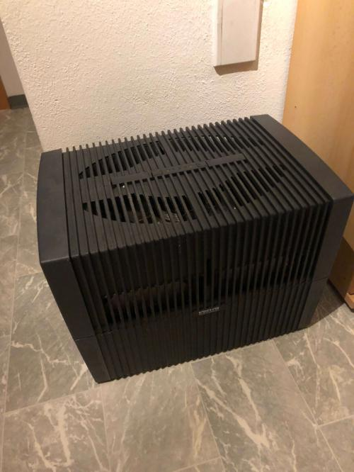
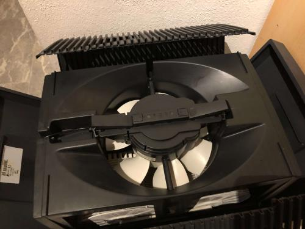
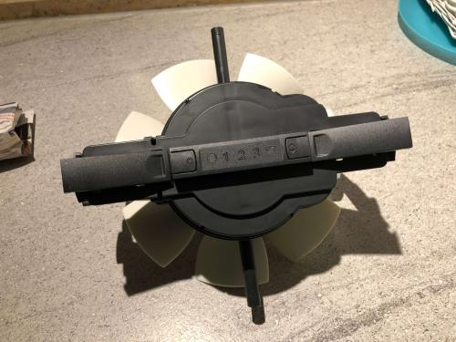
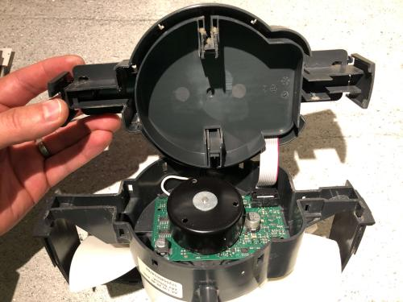
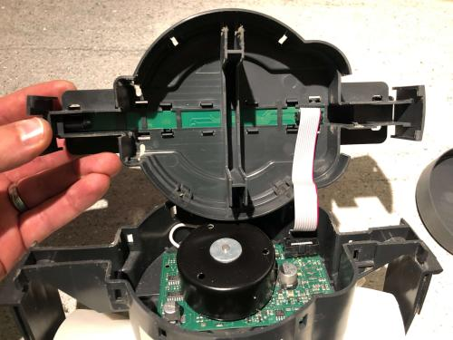
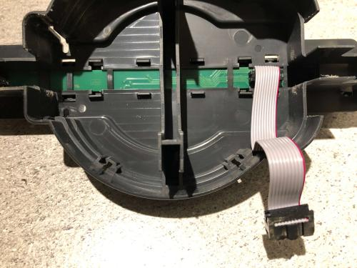
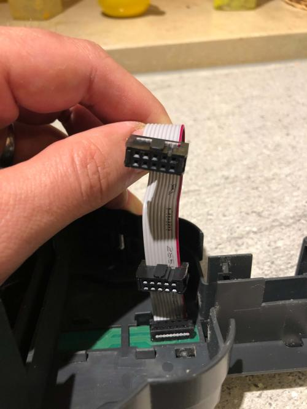
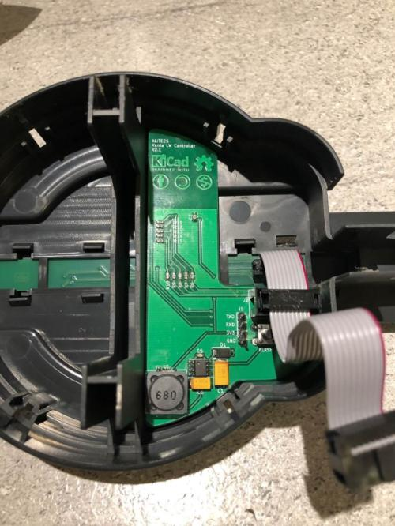

# Venta LW Controller
This project contains the electronics design, assembly and programming instructions for a board to be used in Venta airwashers of '[5 Series Classic](https://venta-usa.com/product-category/airwashers/5-series-classic/)' or '[LW Original](https://www.venta-luftwaescher.de/shop/alle-luftwaescher/original-bis-75-m2/)'  , see [Venta USA](https://venta-usa.com/) or [Venta Germany](https://www.venta-luftwaescher.de/).

The control board is based on an ESP32 module by [Espressif](https://www.espressif.com/) in particular an [ESP32-WROOM-32](http://espressif.com/zh-hans/products/hardware/esp-wroom-32/overview) module.

The intention of this project is to be able to control Venta airwashers remotely, in my case using [ESPHome](https://esphome.io/index.html) and [Home-Assistant](https://www.home-assistant.io/), that is turn it on and off and select the speed and also get information if it is on or off, what the current speed is and if it has an error.

But it is possible to use other tools to generate a firmware or write a completly own firmware for special needs.

## Board components
The board has six components:

1. ESP32 module
2. connector to the Venta airwasher
3. power supply circuit to transform 24V to 3.3V
4. button control circuit using BSS138 N-MOSFETs
5. LED state detection circut using diodes to block current to the ESP32's logic circuit
6. maintenance connector and buttons

## LED state detection circuit design and remarks
To detect the state of the LEDs and so the state of the airwasher diodes are used and the logic input of the ESP are set to HIGH in the PIN configuration of the firmware becuase of the design of the Venta control circuits.

The LEDs are under constant voltage and the control circuit closes when an LED shall be activated. Because of that we have constant 24V if and LED is off. Using a voltage divider to get that down to the ESP32's logic level is not possible because a voltage divider closes the circuit constantly even with very high resistor a little current flows throught the LEDs and as a result the LEDs shine a littel.

So the idea was to prevent current to the ESP32, set the PINs to HIGH and when the Venta controlle closes the circuit the PIN is pulled low.

In fact this works for the blue LEDs but not for the red one. So detecting error case is moved to the firmware logic. That relies on the fact that if the airwasher is on normally one of the speeds LEDs is lit, if not then the error LED is lit.

## Needed materials
| Amount | Part                                                                          | used model                         |
| :----: | ----------------------------------------------------------------------------- | ---------------------------------- |
|   1    | PCB                                                                           |
|   1    | ESP32-WROOOM-32 module                                                        |
|   1    | IDC plug for ribbon cable, 10 pins, 1.27mm cable pitch, 2.54mm contacts pitch | AMPHENOL T812110A101CEU            |
|   1    | IDC socket, 10 pins, 2.54mm contacts pitch                                    | AMPHENOL T821110A1S100CEU          |
|   1    | DC-DC buck converter, SO8, Uout 3.3V, Uin minimal 24V                         | Texas Instruments LM2674M-3.3/NOPB |
|   1    | tantalum capacitor, 22uF, 35VDC, Case D                                       | AVX TAJD226K035RNJ                 |
|   1    | tantalum capacitor, 100uF, 10VDC, Case C                                      | AVX TPSC107M010R0100               |
|   1    | Schottky diode, 30V                                                           | DIODES INCORPORATED B130-13-F      |
|   1    | wire inductor, 68uH, 12x12x6mm                                                | FERROCORE DE1205-68                |
|   1    | ceramic capacitor, 10nF, 0603                                                 |
|   1    | resistor, 10K, 0603                                                           |
|   2    | ceramic capacitor, 100nF, 0603                                                |
|   1    | ceramic capacitor, 10uF, 0603                                                 |
|   2    | resistor, 470R, 0603                                                          |
|   2    | resistor, 4K7, 0603                                                           |
|   2    | N-MOSFET, SOT-23                                                              | BSS138                             |
|   5    | diode, SOD-323                                                                | 1N4148WS                           |
|   1    | pin header, 4 pins, 2.54mm pitch                                              |
|   2    | TACT buttons, 6mm                                                             |

## Firmware
As described before I use ESPhome to generate a firmware and Home-Assistant to control the devices.

A sample ESPHome configuration to generate a firmware can be found in the 'ESPHome configuration sample' directoy of this repository. This sample also includes the configuration for an external Bluetooth temperature and humidity sensor [Xiaomi CGG1](https://esphome.io/components/sensor/xiaomi_cgg1.html).

## Installation
To installe the addtional PCB you have remove the fan module from your Venta airwasher and open it. With a flat screwdriver this is no real problem and it can be done without any damage, take you time and wiggle and bend the case also a little to get the points where it is clipped together, once you got the trick it is easy.

Here a Venta LW45:

Open the cover:

Remove the fan module:

Open the fan module:

Remove the seperator:

Remove the ribbon cable from the main board:

Add the addtional plug to the ribbon cable:

Put the PCB in the cover and connect the cable:

Add the seperator, connect the cable to the main board and close the fan module.

You're done!